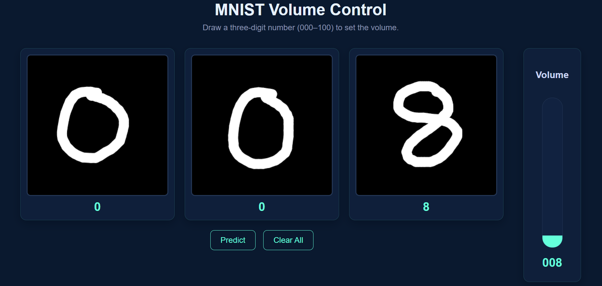
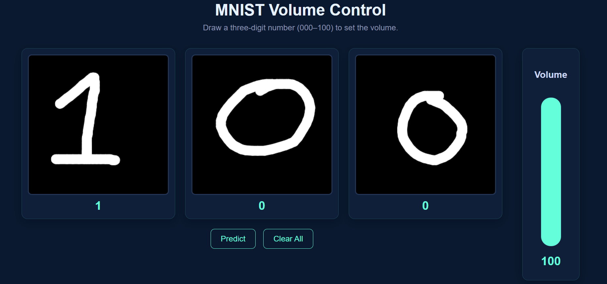
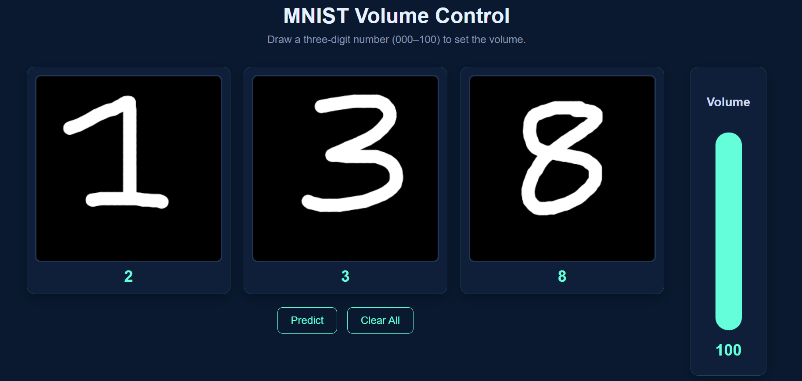

# MNIST Volume Control

A deep learning project where users can **draw digits (000–100) to set the volume interactively**.  
It combines **Python (PyTorch)** for training and benchmarking, **C++ (libtorch)** for optimized inference, and a **JavaScript/ONNX Runtime Web** frontend for browser deployment.

---

##  Features
- **Digit Drawing Interface**: Users draw digits in three separate boxes to form a number between `000`–`100`.
- **CNN-based Recognition**: Trained on MNIST in PyTorch.
- **Real-time Volume Control**: Predicted number dynamically sets the volume bar.
- **Cross-Platform Inference**:
  - **Python**: Training + CPU/GPU benchmarking.
  - **C++**: Optimized TorchScript inference with libtorch.
  - **Web**: ONNX.js deployment for browser demo.

---

## 📂 Project Structure
```
mnist-volume-controller/
├── assets/
│   ├── screenshots          # Screenshots for README
│
├── cpp/                     # C++ inference (CLion)
│   ├── main.cpp
│   ├── CMakeLists.txt
│   └── mnist_cnn.pt         # TorchScript model for C++
│
├── python/                  # Training & benchmarking (PyCharm)
│   ├── train.ipynb
│   ├── benchmark_cpu.py
│   ├── export_onnx.py
│   ├── mnist_cnn.pth        # PyTorch training checkpoint
│   └── mnist_cnn.pt         # TorchScript export
│
├── web/                     # Browser demo
│   ├── volume_index.html
│   ├── volume_style.css
│   ├── volume_script.js
│   └── mnist_cnn.onnx       # Model for browser inference
│
├── README.md
└── .gitignore
```

---

## 🧑‍💻 Setup & Usage

### 1. Train the Model (Python)
1. Open `python/train.ipynb` in Jupyter or Colab.
2. Train CNN on MNIST.
3. Export trained model to TorchScript (`mnist_cnn.pt`) and ONNX (`mnist_cnn.onnx`).

### 2. Benchmark (Python vs C++)
- **Python CPU**: ~0.56 ms  
- **C++ CPU**: ~0.47 ms  
- Benchmarked on the same input (`digit.png`, 1000 runs, avg per inference).

### 3. Run C++ Inference (Local)
```bash
cd cpp
mkdir build && cd build
cmake ..
make
./mnist_cpp digit.png
```

### 4. Run in Browser (Web)
1. Open `web/volume_index.html` in a browser.
2. Draw digits in boxes and click **Predict**.
3. Volume bar updates in real time.

---

## 📊 Benchmarks
| Framework | Device | Avg Latency (ms) |
|-----------|--------|------------------|
| Python    | CPU    | ~0.56            |
| C++       | CPU    | ~0.47            |

*(GPU was slower on MNIST batch=1 due to overhead; not included in demo results.)*


---

## 📸 Screenshots
*(placeholders — replace with actual screenshots)*

- **One digit:** 
- **Two digits:** 
- **Exactly 100:** 
- **Above 100:** 

---

## License
MIT License
